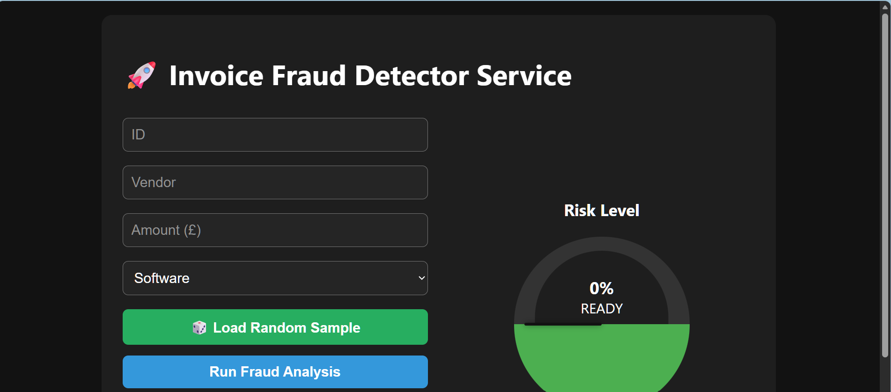
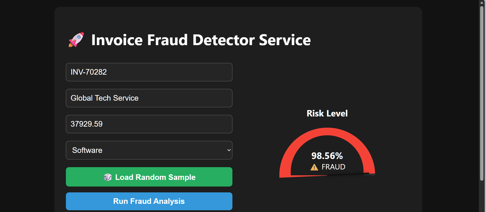
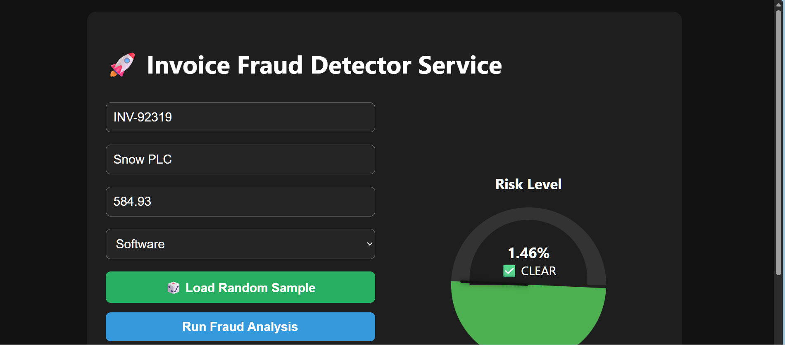

# 🚀 Invoice Fraud Detector Service


An end-to-end Machine Learning service that detects fraudulent invoices using **XGBoost**. This project features a full pipeline: synthetic data generation, model training with SMOTE (oversampling), and a Flask-based web dashboard with a real-time risk speedometer.

---

## 📸 Screenshots




---

## 📁 Project Tree

```text
Invoice_fraud_detector_service
├── core/
│   ├── __init__.py
│   ├── explainer.py
│   ├── generator.py
│   ├── schemas.py
│   └── trainer.py
├── data/
│   └── __init__.py
├── lib/
│   ├── bindings/
│   │   └── utils.js
│   ├── tom-select/
│   │   ├── tom-select.complete.min.js
│   │   └── tom-select.css
│   └── vis-9.1.2/
│       ├── vis-network.css
│       └── vis-network.min.js
├── models/
│   ├── __init__.py
│   └── fraud_model.json
├── screenshots/
│   ├── dashboard_22.png
│   ├── dashboard_31.png
│   └── dashboard_43.png
├── templates/
│   └── index.html
├── tests/
│   ├── __init__.py
│   ├── test_app.py
│   ├── test_generator.py
│   └── test_routes.py
├── .gitignore
├── app.py
├── CONTRIBUTING.md
├── demo.mp4
├── pytest.ini
├── README.md
└── requirements.txt
```

---

## 🛠️ Setup Instructions

### Create a Virtual Environment
```bash
python -m venv venv
source venv/bin/activate  # On Windows: venv\Scripts\activate
```
### Install Dependencies
```bash
pip install -r requirements.txt
```

---

## Run the Pipeline (Sequence is Important!)

You must run these in order to create the **"brain"** for the app:

- Generate Data:
(Creates 500-row fake_invoices.csv)
```bash
python core/generator.py
``` 

- Train AI:
(Trains the model and saves .pkl files) 
```bash
python core/trainer.py
```

- Start Service: 
```bash
python app.py
``` 
- (Launches the dashboard at http://127.0.0.1:5000)

---

## 🕵️‍♂️ How to Use the Dashboard

The AI is trained to recognize specific patterns of risk. To see the "Speedometer" in action, try these test cases:

### ✅ Scenario 1: The Trusted Partner (Low Risk)

- Vendor: Small Ltd

- Amount: 250

- Verdict: The needle will stay in the Green (Low Risk).

### ⚠️ Scenario 2: High-Value Fraud (High Risk)

- Vendor: QuickPay UK

- Amount: 45000

- Verdict: The needle will swing to Red (High Risk) because the AI recognizes the   suspicious vendor name and unusually high amount.

---

## 🧪 Pro Tip: Find random test cases

- In the Dashboard of the UI
- Click the `load random sample` button and an invoice will be generated.
- Click the `Run fraud analysis` button and the AI will decide if an invoice is 
fraudlent or not.

---

## ✨ Interactive Features

- **🎲 One-Click Demo:** Use the "Load Random Sample" button to automatically pull a real record from the dataset. This allows you to quickly test both fraudulent and legitimate scenarios without manual entry.
- **📈 Live Risk Gauge:** The dashboard features a dynamic SVG/CSS needle that reflects the AI's confidence score in real-time.
- **📜 Audit Log:** Every analysis is saved to a session log, allowing you to compare different vendors and risk profiles side-by-side.

---

## 💻 Tech Stack

- Backend: Pydantic, Joblib, Pandas, Faker

- Machine Learning: XGBoost, Scikit-learn, Imbalanced-learn (SMOTE)

- Frontend: Flask, HTML5/CSS3 (Animated Gauge), JavaScript (Fetch API)

---

## 🧪 Automated Testing
This project includes a comprehensive test suite to ensure the data generator and AI API are perfectly synced. Run them with:

```bash
pytest
```

---

## 🤝 Contributing

- Contributions are welcome! If you have ideas to improve the fraud detection logic or the dashboard UI:

- Fork the Project.

- Create your Feature Branch (git checkout -b feature/AmazingFeature).

- Commit your Changes (git commit -m 'Add some AmazingFeature').

- Push to the Branch (git push origin feature/AmazingFeature).

- Open a Pull Request.

---

## 📝 Notes

- Data Privacy: This project uses synthetic data generated by Faker. No real invoice data is included or required to run the demo.

- Model Accuracy: The XGBoost model is trained on a small synthetic sample (100 rows by default). For higher accuracy in a production setting, increase the n value in generator.py and retrain.

- CORS: Ensure Flask-CORS is active if you plan to host the frontend and backend on different ports.

---

## 🛣️ Roadmap Features

- [ ] Email Alerts: Trigger an SMTP or REST API notification when an invoice is flagged as "High Risk."
- [ ] Configurable Export Pipeline: Use `Pandas/Polars` to directly serialize outputs to `CSV`, `Parquet`, or `SQL` targets.
- [ ] Batch Processing: Add a multipart file upload endpoint to chunk incoming `CSVs` through the inference pipeline.
- [ ] User Auth: Add user authentication using hashed passwords (bcrypt) and JWT/session tokens.
- [ ] Interactive Graph & Feature Importance Visualizer: Map `SHAP/LIME` outputs into `JSON` node-edge graphs for vis-network.min.js rendering.  
- [ ] Real-Time Streaming Ingestion & Inference Endpoint: Build an async WebSocket/SSE endpoint to stream live event payloads to the model.
- [ ] Automated Model Drift & Performance Monitoring: Run background statistical shift tests (KS-test/PSI) to trigger automated retraining pipelines.
- [ ] Rust-Accelerated Batch Generator: Implement a native `Rust` generator via PyO3 to eliminate `Python`'s GIL bottlenecks.

---

## ❤️ Thanks

Scikit-learn & XGBoost: For the heavy lifting in the ML pipeline
Faker - For helping create the fake data.

---

**Built By Roy Peters** [Click here for contact details😁](https://www.linkedin.com/in/roy-p-74980b382/)